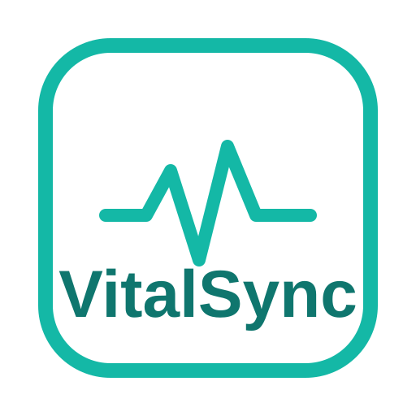
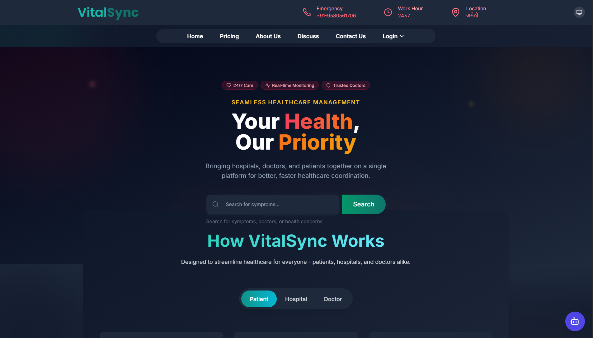
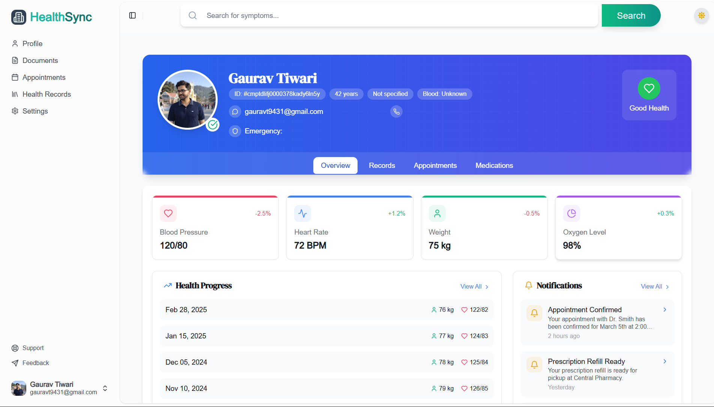
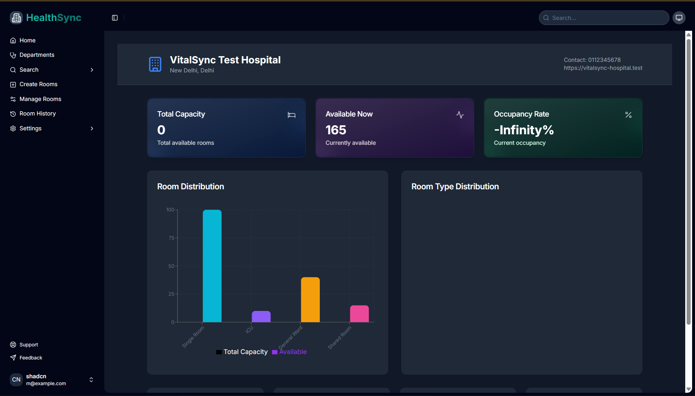
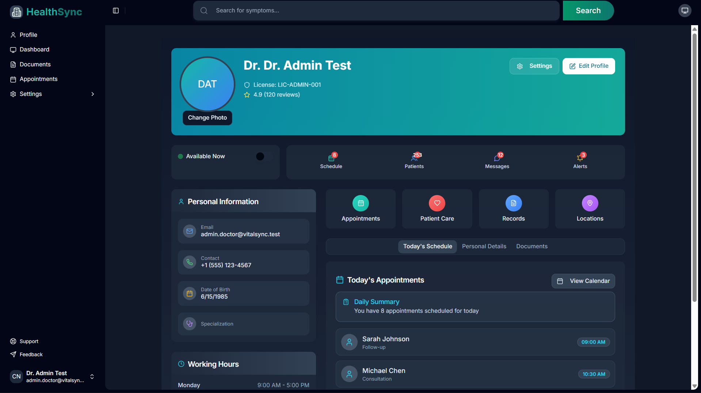
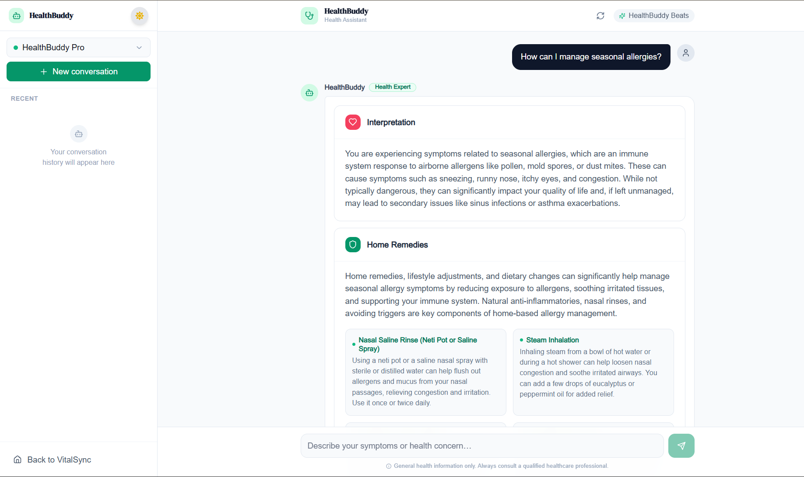

<div align="center">



# 🩺 VitalSync

### A Next-Generation Healthcare Management Platform

💡 Revolutionizing patient-doctor interactions · 🏥 Optimizing hospital operations · ❤️ Enhancing patient care through AI

[](https://nextjs.org/)
[](https://www.typescriptlang.org/)
[](https://vercel.com/)
[](https://www.postgresql.org/)
[](https://deepmind.google/technologies/gemini/)

> By **Gaurav Tiwari** — 2026

</div>

---

## 📸 Screenshots

### 🏠 Home Page


---

### 👤 Patient Dashboard


---

### 🏥 Hospital Dashboard


---

### 👨‍⚕️ Doctor Dashboard


---

### 🤖 HealthBuddy AI — Medical Assistant


---

## 📋 Table of Contents

- [Overview](#-overview)
- [Core Features](#-core-features)
- [AI-Powered Capabilities](#-ai-powered-capabilities)
- [Tech Stack](#-tech-stack)
- [Installation](#-installation)
- [Contributing](#-contributing)

---

## 🔍 Overview

VitalSync is a comprehensive healthcare platform built with modern web technologies, designed to seamlessly connect patients with healthcare providers while giving hospitals powerful tools to manage their operations efficiently.

---

## 💫 Core Features

| Feature | Description |
|---|---|
| 📅 **Appointment Booking** | Schedule online & offline consultations with AI-powered suggestions |
| 📌 **OPD Queuing System** | Real-time queue tracking with SMS notifications and priority-based sorting |
| 🛏️ **Bed Management** | Live hospital bed availability with AI-driven allocation |
| 📂 **Digital Records** | Unified patient history, prescriptions, and document sharing |
| 🌎 **Multilingual Support** | Google Translate integration with multilingual voice input |
| 💳 **Integrated Billing** | Transparent pricing with insurance claim automation |
| 🔔 **Smart Reminders** | Medication & appointment notifications with dosage tracking |

---

## 🤖 AI-Powered Capabilities

### HealthBuddy AI — Medical Assistant

| **HealthBuddy Pro** (Premium) | **HealthBuddy Flash** (Free) |
|---|---|
| ✅ Structured medical data generation | ✅ Real-time medical information stream |
| ✅ Personalized health insights | ✅ General health education |
| ✅ Integration with medical records | ✅ Basic symptom assessment |
| ✅ Advanced analytics and trends | ✅ Public health resources |

### 🔎 Semantic Symptom Search
- Multilingual symptom search powered by NLP
- Context-aware results based on patient history
- AI-interpreted symptom suggestions

---

## 🛠 Tech Stack

| Category | Technologies |
|---|---|
| **Frontend** | Next.js 16 (App Router, Turbopack), React 19, TypeScript 5.9, shadcn/ui |
| **Styling** | Tailwind CSS 4 (CSS-first config), Radix UI, tw-animate-css |
| **UI/UX** | Motion 13, Lucide React, Recharts 3 |
| **Typography** | Plus Jakarta Sans (body), Sora (display & vitals readouts) |
| **Backend** | Node.js, Next.js Route Handlers |
| **Database** | PostgreSQL, Prisma ORM 6 |
| **Authentication** | Lucia Auth |
| **AI/ML** | Gemini API |
| **Realtime** | LiveKit, Pusher |
| **DevOps** | Vercel |

---

## 🚀 Installation

### Prerequisites
- Node.js (v20.9+, required by Next.js 16)
- npm or yarn
- PostgreSQL database
- Environment variables (see `.env.example`)

### Setup

1. **Clone the repository**
   ```bash
   git clone https://github.com/Gauravtiwari31/VitalSync-Deploy.git
   cd VitalSync-Deploy
   ```

2. **Install dependencies**
   ```bash
   npm install
   ```

3. **Configure environment variables**
   ```bash
   cp .env.example .env.local
   # Fill in your values in .env.local
   ```

4. **Run database migrations**
   ```bash
   npx prisma migrate dev
   ```

5. **Start the development server**
   ```bash
   npm run dev
   ```

6. Open [http://localhost:3000](http://localhost:3000) in your browser.

---


## 📄 License

VitalSync is licensed under the **MIT License**.

---

<div align="center">
  <p>Made with ❤️ for healthcare professionals and patients worldwide</p>
  <p>© 2026 VitalSync · Gaurav Tiwari</p>
</div>
